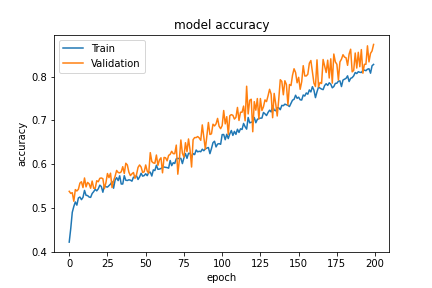

<h>Alzheimer-s-disease-Classification-using-vision-Transformer<h>

 data has been collected from kaggle and here is the link>
<a>https://www.kaggle.com/datasets/avrast/alzeihmer</a>

Alzheimer's disease (AD) is a neurological disorder that is likely to grow, spread, and deteriorate. It causes our brain cells to die leading to complete loss of memory and physical impairment. As a leading cause of death in developing countries, estimates say that approximately 6 million people of 65 age and above suffer from Alzheimer's disease in the United States.
Here in this I have used vision transformer in the early detection of Alzheimer's disease.

  
  
  
  

